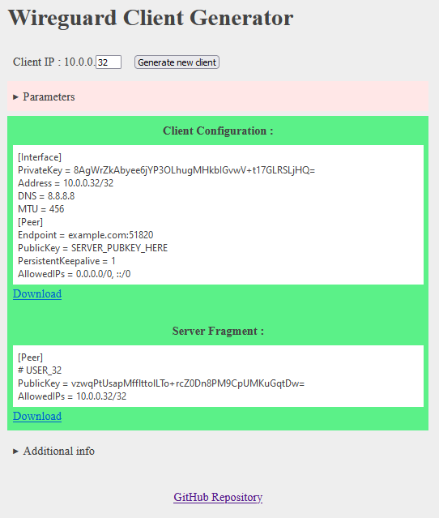

## Wireguard Client Generator

Try it here :

[New_WG_User.html](https://htmlpreview.github.io/?https://github.com/seb1k/Wireguard-Client-Generator/blob/main/New_WG_User.html)

## What's new :

- Better UI
- Single HTML file
- More option
- Data saved in localstorage for futur use.

Based on jcarrano tool :

[https://jcarrano.github.io/wg-keygen-notrust/](https://github.com/jcarrano/wg-keygen-notrust)
